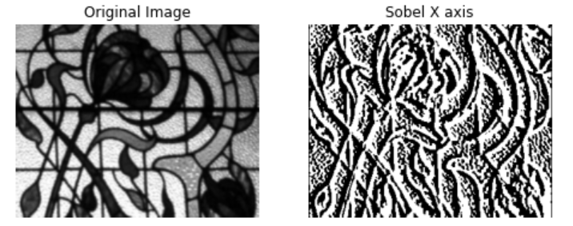
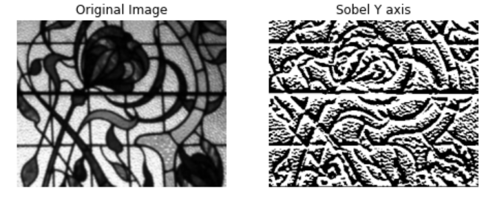

# Edge-Detection

## Aim:

To perform edge detection using Sobel, Laplacian, and Canny edge detectors.

## Software Required:

Anaconda - Python 3.7

## Algorithm:

### Step 1:

Import the required packages for further process.

### Step 2:

Read the image and convert the bgr image to gray scale image.

### Step 3:

Use any filters for smoothing the image to reduse the noise.

### Step 4:

Apply the respective filters -Sobel,Laplacian edge dectector and Canny edge dector.

### Step 5:

Display the filtered image using plot and imshow.
 
## Program:

### DEVELOPED BY : ABRIN NISHA A 

### REG NO : 212222230005

``` Python
import cv2
import matplotlib.pyplot as plt
```

### Load the image, Convert to grayscale and remove noise :

```python
import cv2
import matplotlib.pyplot as plt

img=cv2.imread("windows.jpg",0)
gray=cv2.cvtColor(img,cv2.COLOR_GRAY2RGB)
gray = cv2.GaussianBlur(gray,(3,3),0)
```

### SOBEL EDGE DETECTOR:

### SOBEL X AXIS :

```PYTHON
sobelx = cv2.Sobel(gray,cv2.CV_64F,1,0,ksize=5)
plt.figure(figsize=(8,8))
plt.subplot(1,2,1)
plt.imshow(gray)
plt.title("Original Image")
plt.axis("off")
plt.subplot(1,2,2)
plt.imshow(sobelx)
plt.title("Sobel X axis")
plt.axis("off")
plt.show()
```

### SOBEL Y AXIS :

```python
sobely = cv2.Sobel(gray,cv2.CV_64F,0,1,ksize=5)
plt.figure(figsize=(8,8))
plt.subplot(1,2,1)
plt.imshow(gray)
plt.title("Original Image")
plt.axis("off")
plt.subplot(1,2,2)
plt.imshow(sobely)
plt.title("Sobel Y axis")
plt.axis("off")
plt.show()
```

### SOBEL XY AXIS :

```python
sobelxy = cv2.Sobel(gray,cv2.CV_64F,1,1,ksize=5)
plt.figure(figsize=(8,8))
plt.subplot(1,2,1)
plt.imshow(gray)
plt.title("Original Image")
plt.axis("off")
plt.subplot(1,2,2)
plt.imshow(sobelxy)
plt.title("Sobel XY axis")
plt.axis("off")
plt.show()
```

### LAPLACIAN EDGE DETECTOR:
```PYTHON
lap=cv2.Laplacian(gray,cv2.CV_64F)
plt.figure(figsize=(8,8))
plt.subplot(1,2,1)
plt.imshow(gray)
plt.title("Original Image")
plt.axis("off")
plt.subplot(1,2,2)
plt.imshow(lap)
plt.title("Laplacian Edge Detector")
plt.axis("off")
plt.show()
```

### CANNY EDGE DETECTOR:

```python
canny=cv2.Canny(gray,120,150)
plt.figure(figsize=(8,8))
plt.subplot(1,2,1)
plt.imshow(gray)
plt.title("Original Image")
plt.axis("off")
plt.subplot(1,2,2)
plt.imshow(canny)
plt.title("Canny Edge Detector")
plt.axis("off")
plt.show()
```
## Output:

### SOBEL EDGE DETECTOR

### SOBEL X AXIS :



### SOBEL Y AXIS :



### SOBEL XY AXIS :


### LAPLACIAN EDGE DETECTOR


### CANNY EDGE DETECTOR


## Result:

Thus the edges are detected using Sobel, Laplacian, and Canny edge detectors.
